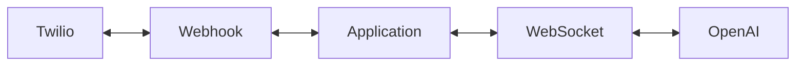

# AI Outage Assistant
This project is a demo application built with Twilio ConversationRelay and OpenAI. Imagine an Internet provider called XYZ Internet has a support phone number where it's customers can call in to get outage information or get help to troubleshoot their home Internet.

## Prerequisites
The application is based on Node.js and running the latest version is encouraged, since the application has not been tested with version earlier than v23. Get Node.js [here](https://nodejs.org). 

The application needs the following services:

* **Twilio Account** - sign up for a free trial [here](https://www.twilio.com/try-twilio)
* **Twilio Number (with Voice Capabilities)** - follow the guide [here](https://help.twilio.com/articles/223135247-How-to-Search-for-and-Buy-a-Twilio-Phone-Number-from-Console)
* **OpenAI Platform Account** - setup an account and get an API key [here](https://platform.openai.com/api-keys)

The application is not designed to be used in production, so for testing locally the Websocket is exposed to the Twilio services by using LocalTunnel. This is a free, easy-to-use bridge. Installation and configuration is described below.

## Voice Commands
This application has two different types of voice commands. The application has a very basic menu that will either let the caller get outage status (say "Status") or ask for help troubleshooting issues (say "Troubleshoot"). When the caller says "Troubleshoot" the user will be asked to describe the problem, which then is sent to OpenAI to get an answer.

