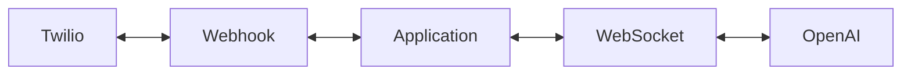

# AI Outage Assistant
Demo application built with Twilio ConversationRelay and OpenAI

## Voice Commands
This application has two different types of voice commands. The application has a very basic menu that will either let the caller get outage status (say "Status") or ask for help troubleshooting issues (say "Troubleshoot"). When the caller says "Troubleshoot" the user will be asked to describe the problem, which then is sent to OpenAI to get an answer.

